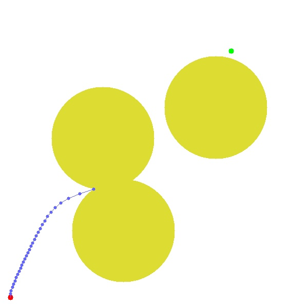

# Assignment 2: Model Predictive Control (MPC)

#### Contributors:
| [Mohd Omama](github.com/mohdomama) | 2020701006 |
| [Kinal Mehta](github.com/kinalmehta) | 2020701019 | 

## Introduction

### Defining variables
$(x_0, y_0)$ -> start coordinate  
$(x_g, y_g)$ -> goal coordinate  
$(x_j, y_j)$ -> $j^{th}$ waypoint coordinates  
$n$ -> number of waypoints  
$(x_ob, y_ob)$ -> obstracle center coordinate  
$R$ -> obstracle radius

### Kinematics
$x_{i+1} = x_i + \dot{x_i} dt$  
$y_{i+1} = y_i + \dot{y_i} dt$  
$
x_j = x_0 + \sum_{i=0}^{j-1}{\dot{x_i} dt} \quad \forall j \in [1,n] \\
$

### Optimization problem
$
\text{min} \qquad\qquad (x_n-x_g)^2 + (y_n-y_g)^2 \\ 
\text{Subject to} \qquad 0 \le \dot{x_i} \le v_{max} \\
\qquad\qquad\qquad 0 \le \dot{y_i} \le v_{max} \quad \forall i \in [0,n-1] \\ 
\text{if obstracles} \quad (x_j-x_{ob})^2 + (y_j-y_{ob}) \ge R^2 \quad \forall j \in [1,n]
$

## MPC Without Obstracles

## MPC With Obstracles

## Failure Case
- Here we observe failure case.
- This is because we linearise the obstracle constraints pointwise which leads to local minima convergence.

## Work Distribution
- Mohd Omama: Without Obstracles
- Kinal Mehta: With Obstracles

---
$\copyright$ *Team R2D2*
